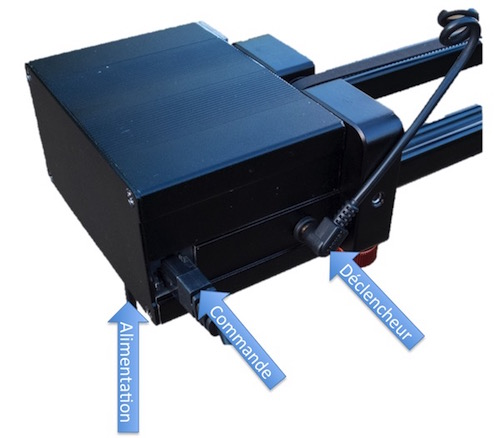
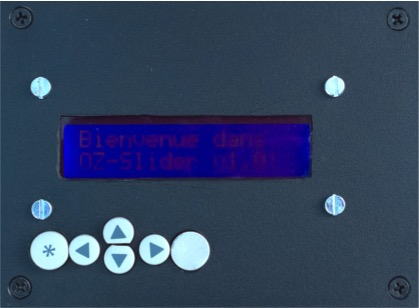

#OZ-Slider version 1.0
#Guide de l'utilisateur
--
## Installation du matériel
### Connexion des modules
Trois modules composent le Slider, l'alimentation, le boitier de commande et le Slider.

* Connecter l'alimentation au Slider.

* Connecter le boitier de commande au Slider.

* Mettre sous tension l'ensemble depuis le boitier d'alimentation.

Le boitier de commande affiche un message de bienvenue.

## Configuration du cycle
Une fois les éléments correctement connectés et sous tension, un message de Bienvenue est affiché.

>`Bienvenue dans`
 
>`OZ-Slider v1.0!`

### Luminosité du LCD
Les touches 🔼 et 🔽 permettent de modifier la luminosité de l'affichage LCD.
Cette fonction est disponible uniquement quand le message de Bienvenue est affiché.

*️⃣ pour passer à l'étape suivante.
### Longueur de déplacement du chariot
>`Long. du mvt.  >

>680 mm

▶️ permet de passer au paramètre suivant.

Par défaut il s'agit de la valeur maximum de déplacement du chariot en mm. Il n'est pas possible de saisir une valeur supérieure à la valeur maximum.

*️⃣ pour modifier la valeur. Le curseur clignote sur le premier digit.

▶️ ou ◀️ pour changer de digit.

🔼 ou 🔽 pour changer la valeur du digit.

*️⃣ pour valider la modification.
### Durée du cycle
>`< Long. cycle >`

>`60 min`

◀️ permet de revenir au paramètre précédent.

▶️ permet de passer au paramètre suivant.

Durée en minute du cycle complet de prise de vues et de déplacement. Par défaut il est à 60 min. La durée maximale est de 1020 minutes soit 17h.

*️⃣ pour modifier la valeur. Le curseur clignote sur le premier digit.

▶️ ou ◀️ pour changer de digit.

🔼 ou 🔽 pour changer la valeur du digit.

*️⃣ pour valider la modification.
### Intervalle de prise de vue
>`< Intervalle   >`

>`3 s`

◀️ permet de revenir au paramètre précédent.

▶️ permet de passer au paramètre suivant.

Durée d'un cycle, déplacement plus prise de vue en seconde. Par défaut il est à 3s.

*️⃣ pour modifier la valeur. Le curseur clignote sur le premier digit.

▶️ ou ◀️ pour changer de digit.

🔼 ou 🔽 pour changer la valeur du digit.

*️⃣ pour valider la modification.
### Direction du déplacement
>`<  Direction   >`

>`Depuis le moteur`

◀️ permet de revenir au paramètre précédent.

▶️ permet de passer au paramètre suivant.

Deux choix possibles, `Depuis le moteur` ou `Vers le moteur`. Par défaut c'est le choix `Depuis le moteur` qui est actif.

*️⃣ pour modifier la valeur.

🔼 ou 🔽 pour changer la direction.

*️⃣ pour valider la modification.
### Terminer la configuration
◀️ permet de revenir au paramètre précédent.

>`< Terminer conf?`

*️⃣ pour terminer la configuration.

## Lancement du cycle
### Affichage de la configuration du cycle
Une fois la configuration validée, elle est affichée sur deux pages écrans.
>`Mvt. : 680 mm`

>`Cycle : 60 min`

🔽 pour afficher la page suivante.

>`Inter.: 3 s`

>`Depuis le moteur`

🔼 pour afficher la page précédente.

*️⃣ pour passer à l'étape suivante.
### Affichage des paramètres calculés
#### Temps de pause maximum
Le boîtier photo doit être configuré avec un temps de pause inférieur à celui indiqué. Le temps calculé tient compte du déplacement du chariot, de son amortissement et du temps de déclenchement du boitier. L'unité est la milliseconde.
>`Temps de pause `

>`2243 ms maximum`

*️⃣ pour passer à l'étape suivante.
#### Nombre de pauses
Cette valeur indique le nombre de photos qui seront réalisées pendant le cycle.
>`Nb de pauses`

>`900 pauses`

*️⃣ pour passer à l'étape suivante.
### Dernières consignes avant le lancement du cycle
#### Connecter l'appareil photo
Ne pas oublier de connecter l'appareil photo à l'aide du câble de commande.

*️⃣ pour passer à l'étape suivante.
#### Placer le chariot
Bien positionner le chariot au point de départ. **Attention !** à l'indication donnée par le module de commande.

* Côté moteur : Le chariot doit être positionné au plus prés du moteur.
* Opposé au moteur : Le chariot doit être positionné à l'opposé du moteur.

**Important !** Un mauvais positionnement peut entrainer un blocage et une surchauffe du moteur.

*️⃣ pour passer à l'étape suivante.
### Lancement du cycle ?
>`Lancement du`

>`cycle ?`

L'appuie sur *️⃣ lance le cycle de déplacement + photo.

Pendant le cycle sont affiché :

* Le nombre de photos restant à prendre.
* Le nombre de mm parcourus.

## Fin du cycle 
A la fin du cycle le message `Fin de cycle !` est affiché.
Le chariot reste maintenu pas le moteur.

L'appuie sur *️⃣ libère le chariot.

**Attention !** Si le rail n'est pas à l'horizontal le chariot peut se déplacer et provoquer la chute du matériel.

## Arrêt du cycle
Le bouton ⏺ permet à tout moment d'arrêter le cycle.

**Attention !** Les paramêtres seront perdus il faudra reprendre le cycle depuis le début.